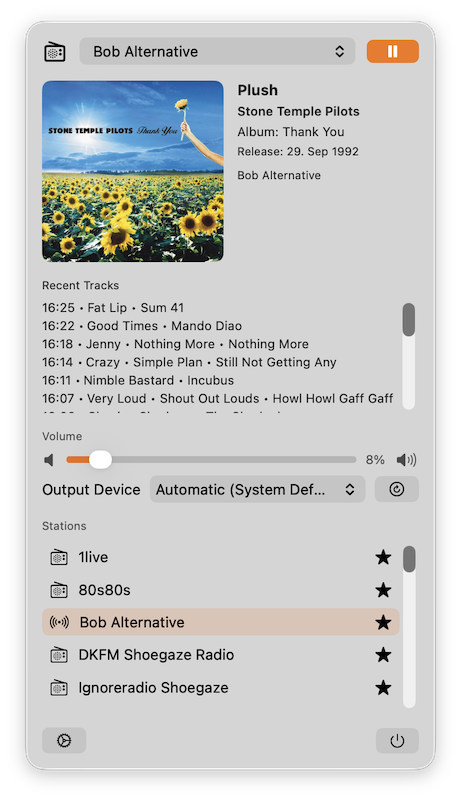

# MenuBarRadio

MenuBarRadio is a macOS SwiftUI "MenuBarExtra" app for streaming web radio with live now-playing metadata.
Fully vibe coded / agentic coded using GPT-5.3-Codex

---

## Screenshots

## Current Features

- Menu bar app with play/pause controls.
- Plays stream URLs (AAC/MP3/HLS and other AVPlayer-compatible endpoints).
- Timed metadata parsing from radio streams (including `StreamTitle` patterns).
- Optional metadata provider API polling per station (for richer song data/artwork).
- Automatic song enrichment on track change (debounced):
  - MusicBrainz search (primary)
  - iTunes Search API fallback
  - Cover Art Archive artwork lookup via MusicBrainz releases
  - cached results and rate-limited requests
- Now-playing content view in the menu popup:
  - artist
  - title
  - year (when available)
  - release date (localized)
  - bitrate / codec / votes (from directory metadata when available)
  - artwork image (when available)
- Configurable menu bar label:
  - show/hide artist
  - show/hide title
  - show/hide year
  - fallback to station name
  - max label length
- Tooltip on menu bar label with additional metadata fields.
- Settings UI:
  - add/edit/delete stations
  - import/export all stations as JSON
  - search stations via Radio Browser API
  - pre-listen stations before adding to your list
  - set stream URL
  - set optional metadata API URL
  - favorite stations
  - configure metadata refresh interval
- Auto-play last station on app launch (optional).
- Restore artwork popup window on app launch (optional).
- Volume control (uses default macOS output device).
- Output device selection (Automatic/system default or a specific device).
- Right-click copy artwork to clipboard.
- Text selection enabled in metadata panel for easy copy.

## Project Structure

- `MenuBarRadioApp.swift`: app entry, `MenuBarExtra`, settings scene.
- `Service/RadioPlayer.swift`: playback engine, metadata parsing, persistence orchestration.
- `Models.swift`: station, metadata, and app settings models.
- `SettingsStore.swift`: `UserDefaults` JSON persistence.
- `View/ContentView.swift`: menu popup layout.
- `View/HeaderView.swift`: station picker + play/pause.
- `View/MetadataView.swift`: now-playing metadata panel.
- `View/VolumeView.swift`: volume slider.
- `View/StationListView.swift`: station list.
- `View/FooterActionsView.swift`: settings + quit row.
- `View/SettingsView.swift`: station and display configuration UI.
- `Service/RadioDirectory.swift`: provider-agnostic directory interface and Radio Browser implementation.
- `Service/MusicMetadataEnrichmentService.swift`: year/release-date/artwork enrichment with caching and throttling.
- `Support/NowPlayingMetadata+ReleaseDate.swift`: release date formatting helpers.
- `View/ArtworkView.swift`: now-playing artwork rendering (copy to clipboard).
- `View/MenuBarLabelView.swift`: menu bar icon + dynamic text label.

## Build & Run

1. Open `MenuBarRadio.xcodeproj` in Xcode.
2. Build and run the `MenuBarRadio` target.
3. The app appears as a menu bar item.
4. Open `Settings` from the menu popup to configure your streams.

## Implementation Plan

1. Build reliable stream playback core with `AVPlayer`.
2. Extract metadata from timed stream data (`ICY`/ID3/common metadata keys).
3. Add optional provider metadata endpoint polling.
4. Add station management and persistence.
5. Add configurable menu bar label and tooltip.
6. Add settings for future audio controls.
7. Stabilize with tests/logging/error handling and prepare release packaging.

## TODO

- Validate and normalize stream URLs in settings.
- Improve metadata provider mapping with per-station field mapping templates.
- Add explicit error state in UI for unreachable streams.
- Add per-app output routing (avoid changing system default).
- React to system device changes (auto-refresh device list).
- Add equalizer/band controls (bass/mid/treble).
- Add keyboard shortcuts and media key support.
- Add menu-bar-only launch option and optional dock icon behavior.
- Add unit tests:
  - metadata parsing
  - persistence
  - label formatting
- Add UI tests for station CRUD and playback flow.

## Notes

- Some URLs (for example App Store/iTunes pages) are not direct audio streams and cannot be played directly by `AVPlayer`.
- Direct stream URLs (like `.../livestream-redirect/...aac` or `.../mp3-192/mediaplayer`) are supported when the endpoint serves playable audio.
