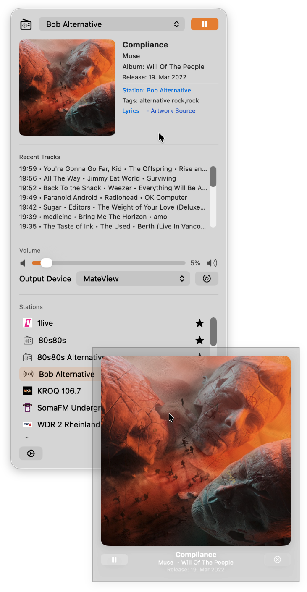

# MenuBarRadio

MenuBarRadio is a macOS `MenuBarExtra` app for streaming internet radio with rich, automatically enriched now-playing information. Beyond simple play/pause and station management, it parses live stream metadata, cross-references it against MusicBrainz, the iTunes Search API, and the Cover Art Archive to fill in artist, title, release year, and artwork, and can even fetch lyrics via LRCLIB — all shown directly in the menu bar popover.

Fully vibe coded / agentic coded using GPT-5.3-Codex.

---

## Screenshots



## Features

- Menu bar app with play/pause controls.
- Plays stream URLs (AAC/MP3/HLS and other AVPlayer-compatible endpoints).
- Timed metadata parsing from radio streams (including `StreamTitle` patterns).
- Optional metadata provider API polling per station (for richer song data/artwork).
- Automatic song enrichment on track change (debounced):
  - MusicBrainz search (primary)
  - iTunes Search API fallback
  - Cover Art Archive artwork lookup via MusicBrainz releases
  - cached results and rate-limited requests
- Now-playing content view in the menu popup:
  - artist
  - title
  - year (when available)
  - release date (localized)
  - bitrate / codec / votes (from directory metadata when available)
  - artwork image (when available)
  - lyrics popover (via LRCLIB)
- Configurable menu bar label:
  - show/hide artist
  - show/hide title
  - show/hide year
  - fallback to station name
  - max label length
- Tooltip on menu bar label with additional metadata fields.
- Settings UI:
  - add/edit/delete stations
  - import/export all stations as JSON
  - search stations via Radio Browser API
  - pre-listen stations before adding to your list
  - set stream URL
  - set optional metadata API URL
  - favorite stations
  - configure metadata refresh interval
  - configure recent track history length
  - show/hide Dock icon
  - launch at login
- Auto-play last station on app launch (optional).
- Restore artwork popup window on app launch (optional).
- Volume control (uses default macOS output device unless overridden).
- Output device selection (Automatic/system default or a specific device).
- Recent tracks history list in the menu popup.
- Right-click copy artwork to clipboard.
- Text selection enabled in metadata panel for easy copy.

---

## Requirements

| | |
|---|---|
| macOS | 14.0 Sonoma or later |
| Architecture | Apple Silicon only |

---

## Installation

### Build from source

1. Open `MenuBarRadio.xcodeproj` in Xcode.
2. Build and run the `MenuBarRadio` target.
3. The app appears as a menu bar item.
4. Open `Settings` from the menu popup to configure your streams.

### Prebuilt DMG

A ready-to-run build is available as `MenuBarRadio-1.0.dmg` (ad-hoc signed, Apple Silicon only). Since it isn't notarized by Apple, macOS blocks it on first launch. Remove the quarantine flag before opening:

```bash
xattr -dr com.apple.quarantine /Applications/MenuBarRadio.app
```

Alternatively, right-click the app in Finder and choose "Open".

---

## Project Structure

- `MenuBarRadioApp.swift`: app entry, `MenuBarExtra`, settings scene.
- `Service/RadioPlayer.swift`: playback engine, metadata parsing, persistence orchestration.
- `Models.swift`: station, metadata, and app settings models.
- `SettingsStore.swift`: `UserDefaults` JSON persistence.
- `View/ContentView.swift`: menu popup layout.
- `View/HeaderView.swift`: station picker + play/pause.
- `View/MetadataView.swift`: now-playing metadata panel.
- `View/VolumeView.swift`: volume slider.
- `View/SongHistoryView.swift`: recent tracks history list.
- `View/StationListView.swift`: station list.
- `View/FooterActionsView.swift`: settings + quit row.
- `View/SettingsView.swift`: station and display configuration UI.
- `Service/RadioDirectory.swift`: provider-agnostic directory interface and Radio Browser implementation.
- `Service/MusicMetadataEnrichmentService.swift`: year/release-date/artwork enrichment with caching and throttling.
- `Support/NowPlayingMetadata+ReleaseDate.swift`: release date formatting helpers.
- `View/ArtworkView.swift`: now-playing artwork rendering (copy to clipboard).
- `View/MenuBarLabelView.swift`: menu bar icon + dynamic text label.

## Notes

- Some URLs (for example App Store/iTunes pages) are not direct audio streams and cannot be played directly by `AVPlayer`.
- Direct stream URLs (like `.../livestream-redirect/...aac` or `.../mp3-192/mediaplayer`) are supported when the endpoint serves playable audio.

---

## License

This project is licensed under the [PolyForm Noncommercial License 1.0.0](https://polyformproject.org/licenses/noncommercial/1.0.0) — see [LICENSE](LICENSE) for details. Free for noncommercial use; commercial use requires a separate license from the author.
